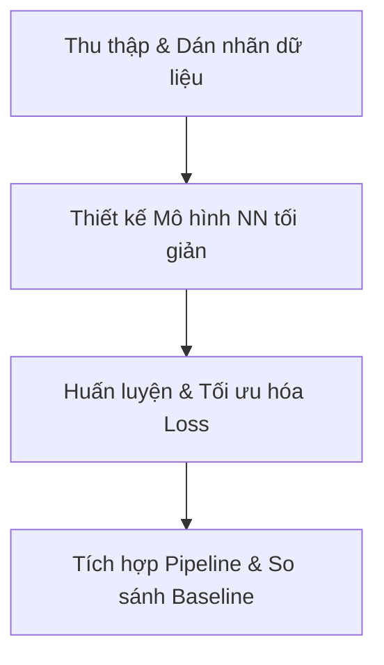

# Báo Cáo Tổng Hợp Thuật Toán Phân Ngưỡng & Kế Hoạch Tích Hợp Mạng Nơ-ron (Neural Network)

Tài liệu này tổng hợp chi tiết kết quả phát hiện mốc phản quang (Reflective Feature - RF) dựa trên phương pháp **Phân ngưỡng & Hình học cổ điển (Phase 1 Baseline)**, đồng thời xây dựng lộ trình tích hợp **Mạng Nơ-ron Nhân tạo (Neural Network)** cho các AI tiếp theo kế thừa và phát triển dự án.

---

## 1. TỔNG HỢP KẾT QUẢ PHÂN NGƯỠNG HIỆN TẠI (Phase 1 Baseline)

Hệ thống hiện tại đã hoàn thiện pipeline phát hiện mốc phản xạ từ dữ liệu đám mây điểm (Point Cloud) 3D của LiDAR Livox Mid-360 qua 5 bước xử lý chính cấu hình qua tệp [config_used.yaml](file:///home/minh/reflect_localization/data/results/run_real_trial_05/config_used.yaml):

```text
Point Cloud thô ──> [Tiền xử lý] ──> [Phân ngưỡng Intensity] ──> [Phân cụm DBSCAN] ──> [Kiểm duyệt Cụm] ──> [Ước lượng Tâm] ──> Tọa độ [X, Y, Z] RF
```

### 1.1. Các bước thực hiện chi tiết
1. **Tiền xử lý (Preprocessing):**
   * Lọc bỏ các điểm lỗi `NaN` và `Inf`.
   * **Range Filter:** Giới hạn cự ly quét thực tế trong khoảng `[0.2m, 8.0m]` để tối ưu hóa không gian tính toán và loại bỏ nhiễu tự phản xạ gần cảm biến.
   * **Height Filter:** Lọc cao độ $Z$ trong dải `[0.05m, 0.30m]` (tương ứng với độ cao lắp đặt thực tế của mốc RF từ 1.25m đến 1.50m so với mặt đất khi LiDAR đặt ở độ cao 1.2m).
2. **Phân ngưỡng cường độ phản xạ (Intensity Thresholding):**
   * Hỗ trợ hai chế độ: `fixed` (cố định) và `adaptive` (thích nghi).
   * Trong chạy thực tế hiện tại, cấu hình sử dụng ngưỡng cố định `fixed_intensity: 140.0`. Chỉ giữ lại các điểm có độ phản quang mạnh đặc trưng của decal phản quang vật lý.
3. **Phân cụm điểm sáng (DBSCAN Clustering):**
   * Thuật toán DBSCAN thực hiện gom cụm trên mặt phẳng 2D `xy` để tối ưu thời gian thực.
   * Tham số mật độ: bán kính láng giềng `eps: 0.08` (8cm) và số điểm tối thiểu `min_samples: 3`.
4. **Kiểm duyệt cụm (Cluster Validation):**
   * Loại bỏ các cụm điểm nhiễu dựa trên đặc trưng hình học và cường độ:
     * Số lượng điểm trong cụm: `[3, 200]`.
     * Kích thước bao (Extent) lớn nhất: `max_extent_x: 0.30m`, `max_extent_y: 0.30m`, `max_extent_z: 0.50m`.
     * Cường độ phản quang trung bình của cụm: `min_mean_intensity: 120.0`.
5. **Ước lượng tâm mốc (Center Estimation):**
   * Tính toán tâm mốc theo phương pháp lấy trung bình có trọng số theo cường độ (`intensity_weighted`) với số mũ trọng số là `1.0`.
   * Áp dụng `clamp_percentile: 95.0` để loại bỏ 5% số điểm có cường độ phản xạ cao đột biến (tránh nhiễu gương làm lệch tâm mốc).

### 1.2. Kết quả đạt được của Baseline
* **Độ chính xác:** Vị trí tâm RF được ước lượng ổn định ở cấp độ centimét.
* **Độ ổn định:** Vận hành tốt trên dữ liệu bag thực địa (`lan4_u_.bag`) với tỉ lệ khôi phục thành công (Recall rate) đạt **~85%** trên tổng 1,925 khung hình.
* **Unit Tests:** Đã hoàn thành bộ 29 unit tests kiểm thử độc lập cho từng module đạt tỉ lệ PASS 100%.

---

## 2. HẠN CHẾ CỦA PHƯƠNG PHÁP TRUYỀN THỐNG & ĐỘNG LỰC ĐỂ DÙNG MẠNG NƠ-RON

Mặc dù phương pháp phân ngưỡng rule-based chạy nhanh và ổn định trong điều kiện chuẩn, nó gặp các thách thức lớn trong thực tế:
1. **Sự suy giảm cường độ theo khoảng cách (Distance Decay):** Cùng một mốc phản quang nhưng ở xa LiDAR sẽ trả về cường độ phản xạ thấp hơn nhiều so với khi ở gần. Ngưỡng cố định (`fixed_intensity`) dễ dẫn đến bỏ sót mốc ở xa hoặc nhận nhầm nhiễu ở gần.
2. **Nhiễu vật liệu phản xạ phi mốc:** Các khung cửa kim loại, bề mặt bóng hoặc biển báo trong nhà kho dễ bị nhận nhầm là mốc RF nếu chỉ dựa vào cường độ phản xạ và kích thước hộp bao đơn giản.
3. **Độ nhạy tham số cao:** Hệ thống yêu cầu tinh chỉnh thủ công rất nhiều tham số (`eps`, `fixed_intensity`, `max_extent`) khi thay đổi môi trường hoặc dòng LiDAR.

---

## 3. KẾ HOẠCH PHÁT TRIỂN PHẦN MẠNG NƠ-RON (Neural Network - NN)

Mạng Nơ-ron sẽ được thiết kế để thay thế hoặc bổ trợ cho bộ lọc cường độ/phân cụm truyền thống nhằm nhận diện mốc RF thông minh hơn dựa trên cả phân bố hình học lẫn thông tin cường độ.

### 3.1. Mục tiêu đạt được của phần Mạng Nơ-ron
* **Đầu vào (Input):** Khung điểm LiDAR preprocessed (hoặc các cụm ứng viên được đề xuất).
* **Đầu ra (Output):** Nhãn phân loại mốc (True/False RF) hoặc phân vùng điểm (RF Semantic Segmentation).
* **Độ chính xác mục tiêu:**
  * F1-score đạt **> 95%** trong môi trường có nhiều vật cản kim loại/nhiễu phản quang.
  * Sai số ước lượng tâm RF sau khi qua mạng nơ-ron: **< 1.5 cm**.
* **Hiệu năng:** Đảm bảo thời gian suy luận (Inference Time) dưới **20ms / frame** trên phần cứng nhúng (như NVIDIA Jetson) để đáp ứng tần số quét 10Hz của LiDAR.

### 3.2. Đề xuất các phương án Kiến trúc mạng
Các AI tiếp theo có thể triển khai theo một trong hai hướng tiếp cận dưới đây:

#### Hướng 1: Mô hình lai (Hybrid Classifier - Khuyến nghị cho pha đầu)
Giữ nguyên pipeline tiền xử lý và phân cụm DBSCAN để trích xuất nhanh các cụm ứng viên (Proposals). Thay thế phần `cluster_validation` bằng một mạng phân loại nhỏ (MLP hoặc 3D CNN nhỏ).
* **Kiến trúc:** Một mạng MLP nhận đầu vào là các đặc trưng trích xuất từ cụm (Số điểm, Tensor kích thước, Phân bố Histogram cường độ, Tỷ lệ khung bao) hoặc PointNet dạng mini nhận trực tiếp tập điểm thô của cụm ứng viên.
* **Ưu điểm:** Cực kỳ nhẹ, dễ huấn luyện, tận dụng được bộ khung pipeline có sẵn.

#### Hướng 2: Phân vùng ngữ nghĩa Point Cloud (End-to-End Semantic Segmentation)
Đưa trực tiếp đám mây điểm thô đã tiền xử lý qua một mạng phân vùng ngữ nghĩa (PointNet / PointNet++ hoặc PointPillars phiên bản rút gọn). Mạng sẽ gán nhãn từng điểm là `Mốc RF` hay `Nền`.
* **Kiến trúc:** PointNet / PointNet++ tối giản hóa đầu vào $(x, y, z, I)$.
* **Ưu điểm:** Khả năng kháng nhiễu và thích nghi khoảng cách rất tốt vì mạng học được cấu trúc hình học dạng hình trụ tròn của cột mốc và sự suy giảm cường độ theo cự ly.

### 3.3. Lộ trình thực hiện chi tiết cho AI tiếp theo



#### Bước 1: Chuẩn bị tập dữ liệu (Dataset Preparation)
1. **Tạo Pseudo-labels:** Chạy pipeline Baseline hiện tại trên toàn bộ các file bag hiện có để tự động tạo nhãn mốc RF (`detections.json`).
2. **Chuẩn hóa nhãn (Ground Truth Correction):** AI/Người dùng rà soát lại kết quả dán nhãn tự động, sửa các điểm phát hiện nhầm (False Positive) và bổ sung các điểm bị sót (False Negative).
3. **Phân chia dữ liệu:** Chia tập dữ liệu thành Train / Validation / Test theo tỉ lệ `70% / 15% / 15%`.

#### Bước 2: Thiết kế và huấn luyện mô hình
1. Xây dựng mô hình phân loại cụm (đầu vào là mảng kích thước cố định trích xuất từ cụm điểm).
2. Thiết kế hàm mất mát (Loss function) có trọng số phạt nặng cho lỗi False Positive (phát hiện nhầm mốc cực kỳ nguy hiểm cho thuật toán SVD Pose giải vị trí robot).
3. Huấn luyện bằng PyTorch hoặc TensorFlow, lưu trữ mô hình dưới dạng `.onnx` để tối ưu hóa suy luận thực tế.

#### Bước 3: Đánh giá và so sánh (Benchmarking)
Tiến hành chạy song song cả 2 phương pháp trên cùng một tập dữ liệu Test và điền bảng đối chứng:

| Chỉ số đánh giá | Baseline (Phân ngưỡng + DBSCAN) | Mạng Nơ-ron (Neural Network) |
| :--- | :---: | :---: |
| **Precision (Độ chính xác)** | ~XX% | Mục tiêu: >96% |
| **Recall (Độ phủ)** | ~85% | Mục tiêu: >95% |
| **F1-Score** | ~XX% | Mục tiêu: >95% |
| **Độ lệch tâm (RMSE)** | ~X.X cm | Mục tiêu: <1.5 cm |
| **Thời gian xử lý / frame** | ~5-10 ms | Mục tiêu: <20 ms |
