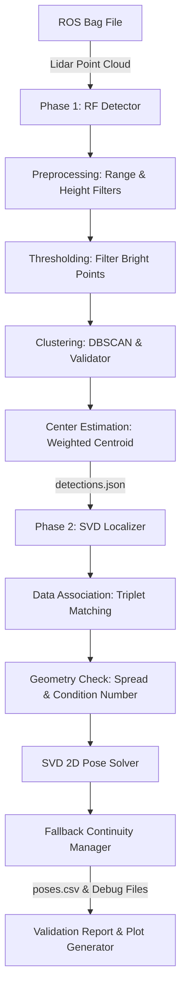

# Báo Cáo Tổng Hợp Toàn Diện Hệ Thống Định Vị RF-SVD

Tài liệu kỹ thuật cấp cao này cung cấp cái nhìn toàn diện về kiến trúc nền tảng, thiết kế luồng xử lý (pipeline), đường đi dữ liệu (data flow), sơ đồ cấu trúc mã nguồn, và hướng dẫn vận hành của dự án định vị dựa trên mốc phản quang (Reflective Feature - RF) sử dụng thuật toán SVD 2D.

---

## 1. TOÀN BỘ KIẾN THỨC NỀN TẢNG (Knowledge Base)

### 1.1. Mục Tiêu Cốt Lõi của Dự Án
Dự án nhằm phát triển một hệ thống định vị chính xác cao, thời gian thực và độc lập dành cho robot di động hoạt động trong các môi trường khép kín (hành lang, nhà kho) có lắp đặt các cột mốc phản quang vật lý. Hệ thống giải quyết hai bài toán chính:
- **Phát hiện cột mốc phản quang (Phase 1):** Tự động phát hiện vị trí tâm và cường độ của cột phản quang từ dữ liệu thô LiDAR Point Cloud mà không phụ thuộc vào dữ liệu camera.
- **Giải tư thế định vị robot (Phase 2):** So khớp tương quan các mốc quan sát được với bản đồ cột mốc toàn cục và tính toán vị trí góc quay 2D $[x, y, \text{yaw}]$ của robot với độ chính xác dưới mức centimét.

### 1.2. Lý Thuyết Toán Học & Thuật Toán Cốt Lõi
Hệ thống kết hợp các phương pháp hình học và đại số tuyến tính nâng cao:

| Phương pháp / Thuật toán | Module Đảm Nhiệm | Nguyên lý & Vai trò |
|---|---|---|
| **DBSCAN Clustering** | `clustering.py` | Phân cụm mật độ điểm phản xạ mạnh thu được sau khi lọc ngưỡng, loại bỏ điểm nhiễu đơn lẻ. |
| **Intensity Weighted Centroid** | `center_estimation.py` | Ước lượng tọa độ tâm mốc chính xác bằng cách lấy trung bình có trọng số theo bình phương cường độ phản xạ ($w_i = I_i^p$). |
| **Triplet Distance Metric** | `data_association.py` | Mã hóa hình học nhóm 3 điểm bằng chiều dài 3 cạnh tam giác sắp xếp tăng dần. So khớp độc lập hệ trục tọa độ mà không cần tư thế khởi tạo. |
| **Adaptive Distance Tolerance** | `data_association.py` | Sai số khoảng cách thích nghi $\epsilon(d)$ nới lỏng khi mốc ở xa (điểm quét thưa) và thắt chặt khi mốc ở gần. |
| **Singular Value Decomposition (SVD) 2D** | `svd_pose.py` | Giải trực tiếp ma trận xoay $R$ và vector tịnh tiến $t$ giảm thiểu bình phương sai số Euclidean giữa hai tập điểm 2D. |
| **Geometric Spread Check & Condition Number** | `geometry_check.py` | Đánh giá độ phân tán không gian và kiểm tra độ suy biến hình học (near-collinear) thông qua tỷ số trị riêng lớn nhất / nhỏ nhất. |

---

## 2. PIPELINE TOÀN CỤC CỦA DỰ ÁN (Project Pipeline)

Hệ thống hoạt động theo trình tự tuần tự kết nối từ Phase 1 sang Phase 2:



### Chi tiết các bước xử lý:
1. **Đọc Dữ Liệu Lidar:** Trích xuất point cloud thô từ file ROS bag (`.bag`) thông qua topic cấu hình sẵn (ví dụ `/livox/lidar`).
2. **Tiền xử lý (Preprocessing):** Lọc bỏ các điểm `NaN/Inf`, lọc khoảng cách (Range Filter) và lọc cao độ đặt mốc (Height Filter) để tối ưu vùng khảo sát mốc phản quang.
3. **Lọc Ngưỡng Cường Độ (Intensity Thresholding):** Chỉ giữ lại các điểm có cường độ phản xạ vượt ngưỡng cố định (Fixed) hoặc thích nghi (Adaptive).
4. **Phân Cụm Điểm (Clustering):** Gom nhóm các điểm phản xạ mạnh bằng thuật toán DBSCAN. Các cụm điểm sau đó được kiểm tra kích thước vật lý (extent) để loại bỏ cụm giả.
5. **Ước Lượng Tâm (Center Estimation):** Tính toán tọa độ tâm mốc 3D trong hệ tọa độ LiDAR (`lidar_frame`) dùng phân bố cường độ.
6. **Lưu Trữ Trung Gian:** Xuất toàn bộ danh sách mốc quan sát dưới dạng `detections.json`.
7. **So Khớp Bản Đồ (Data Association):** Xây dựng các descriptor bộ ba (Triplet descriptors) cho mốc quan sát và mốc bản đồ toàn cục, tiến hành đối sánh độ dài cạnh tam giác để gán ID.
8. **Kiểm Tra Hình Học (Geometry Check):** Đánh giá độ phân tán không gian của các cặp khớp, loại bỏ các trường hợp mốc trùng khít hoặc thẳng hàng suy biến.
9. **Giải Pose SVD:** Tìm ma trận transform $T_{\text{map\_lidar}}$ tối ưu thỏa mãn:
   $$p_{\text{map}} \approx R \times p_{\text{lidar}} + t$$
10. **Bù Trừ Sai Số & Liên Tục:** Nếu giải SVD thất bại (thiếu mốc hoặc suy biến), bộ quản lý dự phòng (Fallback Manager) sẽ bù đắp tư thế robot bằng tư thế hợp lệ cuối cùng trong tối đa 5 khung hình liên tiếp.

---

## 3. LUỒNG DỮ LIỆU CHI TIẾT (Data Flow)

Luồng chuyển đổi cấu trúc dữ liệu qua từng bước xử lý:

### 3.1. Dữ liệu đầu vào (Input)
- **Cảm biến LiDAR:** Point Cloud dạng mảng các điểm $(x, y, z, \text{intensity})$ thu từ tệp `.bag`.
- **Global Map:** File JSON chứa danh sách tọa độ vật lý 3D của các cột mốc phản quang gắn cố định trong nhà kho (hệ tọa độ gốc `map` tại $(0,0,0)$).

### 3.2. Chuyển đổi dữ liệu trung gian
- **Point Cloud thô** $\rightarrow$ **Filtered Point Cloud:** Loại bỏ các điểm ngoài dải cao độ hoặc cự ly quét.
- **Filtered Point Cloud** $\rightarrow$ **DBSCAN Clusters:** Danh sách các cụm điểm 3D.
- **DBSCAN Clusters** $\rightarrow$ **`RFDetection` (detections.json):** Mỗi detection chứa:
  - `detection_id`: ID định danh tạm thời trong frame.
  - `center_lidar`: Tọa độ tâm mốc $[x, y, z]$ trong `lidar_frame`.
  - `intensity`: Cường độ phản xạ trung bình cụm.
- **`RFDetection` & `RFMapLandmark`** $\rightarrow$ **`MatchedPair`:** Các cặp khớp gồm $[p_{\text{lidar}}, p_{\text{map}}]$ kèm theo `weight` và `residual`.
- **`MatchedPair`** $\rightarrow$ **`RobotPose`:** Ma trận transform SVD biểu thị vị trí robot $[x, y, \text{yaw}]$.

### 3.3. Dữ liệu đầu ra (Output)
Hệ thống kết xuất đồng bộ **8 tệp evidence debug** phục vụ kiểm vết:
- **`poses.csv` & `poses.json`:** Tư thế của robot qua từng frame thời gian thực.
- **`rejected_frames.csv`:** Thống kê chi tiết lý do và thời điểm định vị bị lỗi hoặc phải dùng fallback.
- **`association_debug.csv`:** Chi tiết các cặp điểm khớp mốc LiDAR - Bản đồ.
- **`svd_debug.csv`:** Chi tiết ma trận xoay $R$, định thức $\det(R)$, vector tịnh tiến $t$.
- **`geometry_debug.csv`:** Chỉ số condition number và độ phân tán hình học.
- **`frame_debug.csv`:** Thống kê tổng hợp số lượng detection, match thu được.
- **`summary.csv`:** Thống kê số lượng frame OK, Fallback, Rejection toàn cục.

---

## 4. CẤU TRÚC TOÀN BỘ DỰ ÁN (Project Architecture)

### 4.1. Sơ đồ cây thư mục dự án
```text
/home/minh/rf_threshold_localization/
├── config/
│   ├── threshold_field_v1.yaml        # Cấu hình chuẩn hóa chạy bag thật
│   └── threshold_v1.yaml              # Cấu hình kiểm thử synthetic
├── data/
│   ├── bags/
│   │   └── lan4.bag                   # Tệp ROS bag thô thực tế
│   └── maps/
│       └── your_map_simple.json       # Bản đồ 18 landmark đo đạc thực tế
├── DOCS/
│   ├── PHASE1/                        # Tài liệu đặc tả Phase 1
│   └── PHASE2/
│       ├── ARCHITECTURE_PHASE2.md     # Tài liệu thiết kế kiến trúc Phase 2
│       ├── CONTRIBUTING_PHASE2.md     # Quy tắc coding và phát triển Phase 2
│       ├── DEBUG_LOG_PHASE2.md        # Physical Diagnostic Checklist chẩn đoán lỗi
│       ├── FIELD_VALIDATION_LOG.md    # Nhật ký kết quả các lần chạy thực nghiệm
│       └── README_PHASE2.md           # Hướng dẫn tổng quan Phase 2
├── scripts/
│   ├── generate_validation_report.py  # Script tạo báo cáo chẩn đoán & vẽ đồ thị
│   ├── plot_localization_debug.py     # Script visualization các file kết quả
│   ├── run_phase1_to_phase2.py        # Cầu nối chạy liên hoàn Phase 1 + 2
│   └── run_svd_localization.py        # CLI runner thực thi định vị offline
├── src/
│   └── rf_threshold/
│       ├── core/                      # Trọng tâm giải thuật Phase 1
│       │   ├── center_estimation.py
│       │   ├── clustering.py
│       │   ├── detector_pipeline.py
│       │   ├── frame.py
│       │   ├── preprocessing.py
│       │   └── thresholding.py
│       ├── io/                        # Xử lý vào ra dữ liệu
│       │   ├── bag_reader.py
│       │   ├── pointcloud_parser.py
│       │   └── result_writer.py
│       ├── localization/              # Trọng tâm giải thuật Phase 2
│       │   ├── data_association.py
│       │   ├── detection_loader.py
│       │   ├── fallback_manager.py
│       │   ├── geometry_check.py
│       │   ├── localization_writer.py
│       │   ├── localizer_pipeline.py
│       │   ├── map_loader.py
│       │   ├── pose.py
│       │   ├── pose_evaluator.py
│       │   └── svd_pose.py
│       ├── utils/
│       │   └── config.py
│       └── visualization/
│           └── plot_frame.py
├── tests/                             # Bộ 156 bài kiểm thử tự động
└── README.md                          # Hướng dẫn dự án cấp root
```

### 4.2. Vai trò của các tệp quan trọng
- **`run_phase1_to_phase2.py`:** Chương trình chính phối hợp toàn bộ dòng chạy. Thiết lập môi trường `PYTHONPATH` tự động, chạy tuần tự Detector, SVD Localizer và Report Generator.
- **`pose_evaluator.py`:** Lớp đánh giá không cần nhãn ground truth, phát hiện sớm các hiện tượng drift hoặc mất dấu kéo dài.
- **`svd_pose.py`:** Thực hiện thuật toán SVD 2D, đảm bảo kiểm tra hướng quay ma trận $\det(R) > 0$.
- **`data_association.py`:** Triển khai giải thuật so khớp dựa trên descriptor bộ ba cạnh kết hợp cơ chế kiểm duyệt số lượng inliers.
- **`threshold_field_v1.yaml`:** Cấu hình hệ thống, chứa các tham số thích nghi, ngưỡng loại bỏ nhiễu và bộ quản lý fallback phù hợp cho dữ liệu nhiễu thực tế.

---

## 5. CÁCH KHỞI CHẠY VÀ VẬN HÀNH (Execution & Deployment)

### 5.1. Môi trường & Thư viện phụ thuộc
- Hệ điều hành khuyến nghị: Linux (Ubuntu 18.04 / 20.04).
- Phiên bản Python hỗ trợ: Python 3.8 trở lên.
- Các thư viện cốt lõi (liệt kê chi tiết trong `requirements.txt`):
  - `numpy`, `scipy` (tính toán ma trận, giải SVD).
  - `matplotlib` (vẽ đồ thị chẩn đoán).
  - `pyyaml` (đọc tệp cấu hình).
  - `scikit-learn` (chạy DBSCAN phân cụm).
  - Thư viện đọc ROS bag (e.g. `rosbag`, `rospy` tùy thuộc vào thiết lập ROS cục bộ).

### 5.2. Hướng dẫn khởi chạy chi tiết

#### Bước 1: Chuẩn bị môi trường
Cài đặt các thư viện cần thiết:
```bash
pip3 install -r requirements.txt
```

#### Bước 2: Chạy liên hoàn End-to-End (Phát hiện + Định vị + Báo cáo)
Chạy lệnh duy nhất để chạy toàn bộ hệ thống trên tệp bag thực địa:
```bash
python3 scripts/run_phase1_to_phase2.py \
  --bag /home/minh/rf_threshold_localization/data/bags/lan4.bag \
  --map data/maps/your_map_simple.json \
  --config config/threshold_field_v1.yaml \
  --run-name run_real_trial_01
```

*Lưu ý: Nếu muốn bỏ qua Phase 1 và tái định vị nhanh từ file `detections.json` đã có sẵn từ trước, thêm cờ `--phase2-only`:*
```bash
python3 scripts/run_phase1_to_phase2.py \
  --bag /home/minh/rf_threshold_localization/data/bags/lan4.bag \
  --map data/maps/your_map_simple.json \
  --config config/threshold_field_v1.yaml \
  --run-name run_real_trial_01 \
  --phase2-only
```

#### Bước 3: Xem kết quả chẩn đoán và đồ thị
Mở tệp chẩn đoán tự động được lưu tại:
`data/results/run_real_trial_01/validation_report.md`

### 5.3. Các tham số cấu hình quan trọng cần kiểm tra trước khi chạy
1. **Ngưỡng lọc cao độ (`height_filter`):** Mốc phản quang thường được đặt ở một dải cao độ xác định so với cảm biến LiDAR (mặc định trong config thực địa: `min_z: 0.05`, `max_z: 0.30`). Nếu mốc được lắp cao hơn hoặc thấp hơn, phải thay đổi dải này để tránh bị lọc bỏ mất mốc.
2. **Ngưỡng cường độ phản xạ (`fixed_intensity`):** Quyết định việc lọc điểm phản quang thô (mặc định: `fixed_intensity: 140.0`). Nếu môi trường nhiều bụi hoặc mốc cũ mờ, có thể giảm xuống `120.0` để thu nhận nhiều điểm hơn.
3. **Cơ chế fallback (`fallback`):** Đảm bảo đặt `max_consecutive_fallback_frames: 5` để giới hạn trôi tích lũy khi robot đi vào vùng mù mất dấu.
